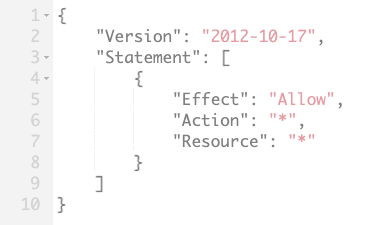

# IAM Exam Tips

## 4 steps to secure your AWS account

- Enable MFA on the root account
- Create an admin group for your administrators and assign the appropate permiassions to this group
- Create user accounts for your administrators
- Add your users to the admin group

## Assign permissions using IAM policy documents consisting of JSON

## Other notes

**IAM is Universal:** It does not apply to regions at this time
**The Root Account:** This is the account created when you first setup your AWS account and it has complete admin access. Secure it as soon a possible and **do not** use it to login day-to-day.
**New Users:** New users have no permissions when they are first created
**Access key ID/Secret access keys:** You cannot use the access key ID and secret access key to login to the console. They are used to access AWS via the API or command line.
**You only get to view the access key ID and secret access key once.** If you lose them, you need to regenerate them.
**Password Rotations:** You can create and customize your password rotation policies.
**IAM Federation:** You can federate your AWS user accounts.
