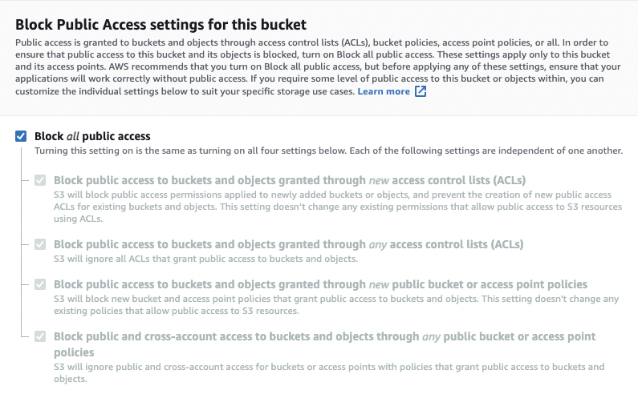

# S3 Security

## Object ACLs vs. Bucket Policies

- **Object ACLs**

  - Apply to an individual object

- **Bucket Policy**
  - Apply to the entire bucket

## ACL's are disabled by default

## Buckets are private by default

## Uploading Files

- When uploading a file to an S3 bucket, you will receive an **HTTP 200** code if the file upload was successful

## If Hosting a Static Website

- **Bucket Policy:** Make entire bucket public
- **Static Content:** User S3 to host static content
- **Automatic Scaling:** S3 automatically scales with demand
