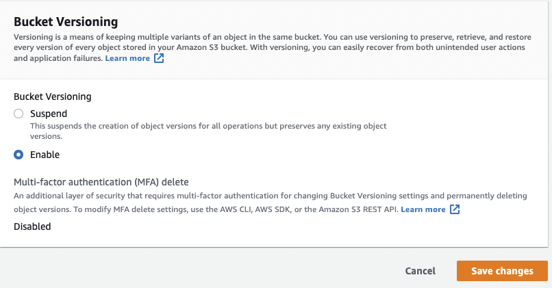

## S3 Versioning

## What is versioning?
- Allows you to have multiple versions of an object within S3

## Advantages of Versioning
- All versions of an object ware stored in S3.  This includes all writes and even if the object is deleted.
- Can be used to backup objects
- Once enabled, versioning cannot be disabled... only suspended.
- Versioning can be integrated into lifecycle rules
- Versioning supports MFA

## To Enable Versioning
- Browse to the bucket you want to enable versioning on
- Click **Properties** tab
- Click **Enable** and the **Save changes** button

## To View Versions
- Browse to your bucket
- Click the file you want to view the versions list
- Click **Version** tab